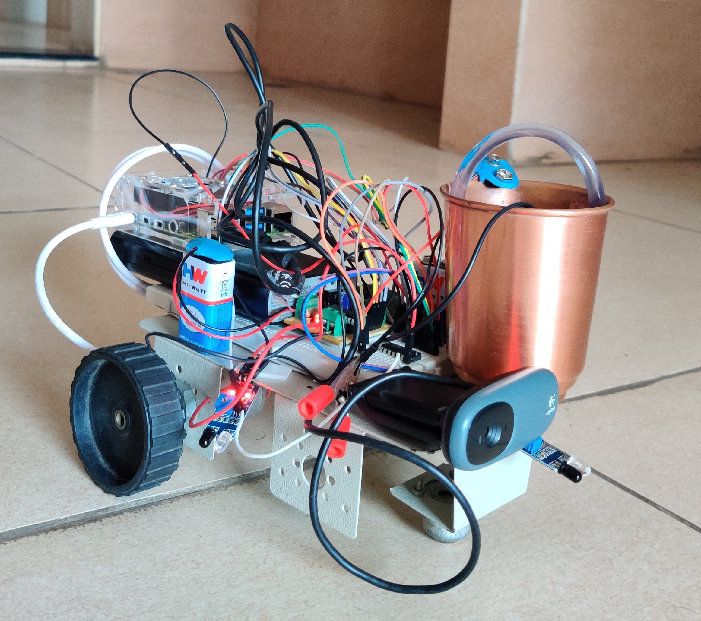

# Fire-fighting-Robot
 
<b>Hardware requirement</b>
 
<table>
	<thead>
		<tr>
			<th>Hardware</th>
			<th>Quantity</th>
		</tr>
	</thead>
	<tr>
		<td>Raspberry Pi</td>
		<td>1</td>
	</tr>
	<tr>
		<td>Car Chesis</td>
		<td>1</td>
	</tr>
	<tr>
		<td>Wheels</td>
		<td>2</td>
	</tr>
	<tr>
		<td>Caster Wheel</td>
		<td>1</td>
	</tr>
	<tr>
		<td>Power Bank</td>
		<td>1</td>
	</tr>
	<tr>
		<td>L293D chip</td>
		<td>2</td>
	</tr>
	<tr>
		<td>IR Sensor</td>
		<td>3</td>
	</tr>
	<tr>
		<td>USB Camera</td>
		<td>1</td>
	</tr>
	<tr>
		<td>Water Pump</td>
		<td>1</td>
	</tr>
	<tr>
		<td>Battery 9V</td>
		<td>2</td>
	</tr>
	<tr>
		<td>Motors</td>
		<td>2</td>
	</tr>
</table>
 
<b>Software requirement</b>
<ul>
	<li>Python3</li>
	<li>OpenCV</li>
	<li>RPi Library</li>
</ul>
 
<h2>Physical Look of Robot</h2>
 
